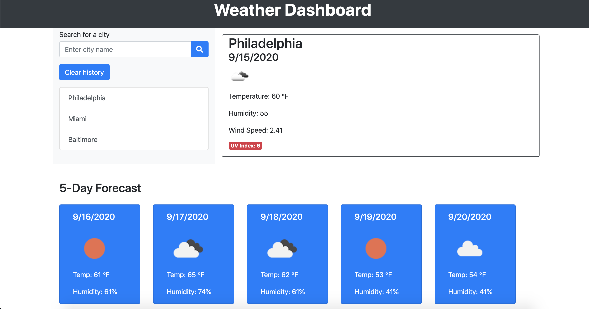

See the deployed site: https://rachelkline.github.io/WeatherDashboard/

In this assignment, we were tasked with using an API to retrieve data from another application and use that data in our own context. We used OpenWeatherMap's API to generate a weather forecast application that returned the current conditions and a five-day forecast for whatever city the user typed into the search box. The city name is added to the list to the left and the data is saved into localStorage so that when the city is clicked on, the correct weather information loads. When the "clear history" button is clicked, both the list and the localStorage is cleared.